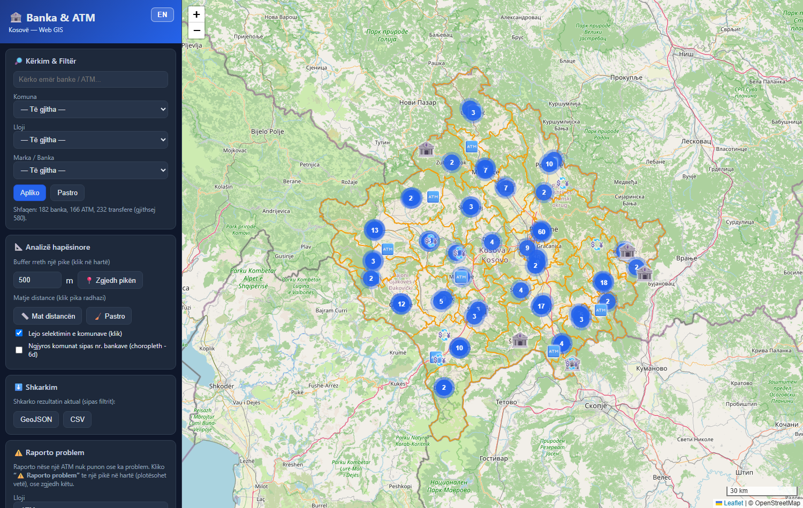
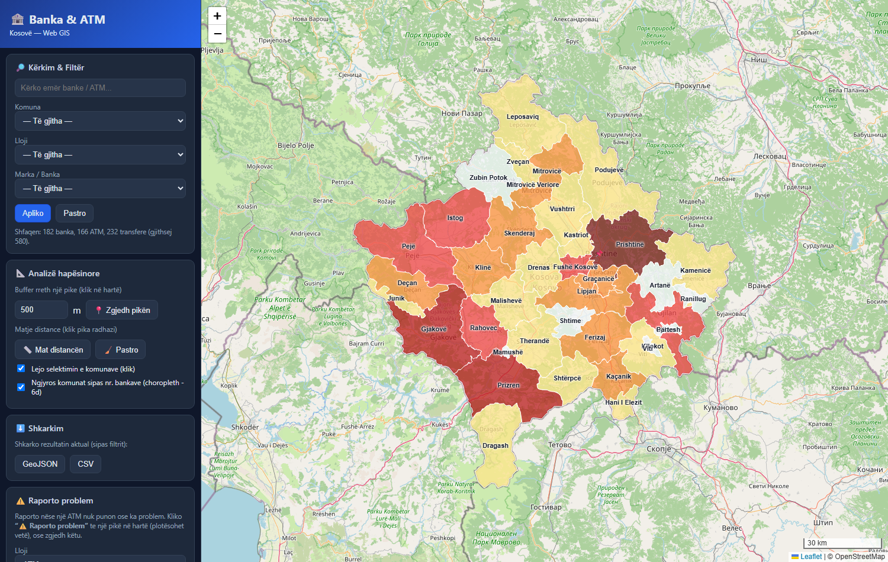
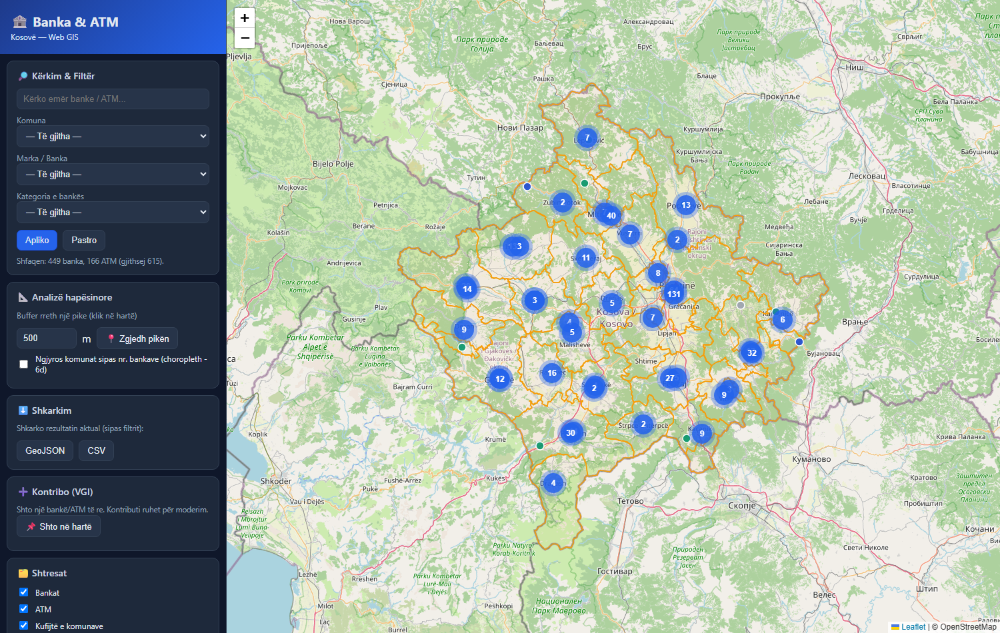
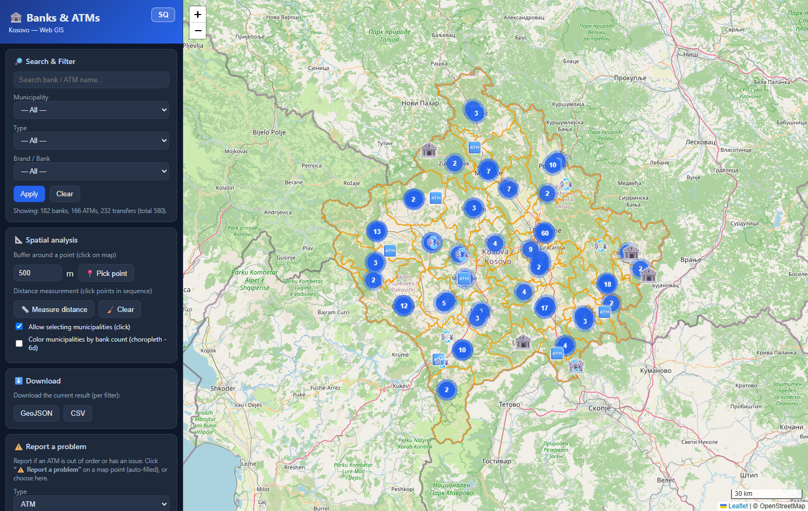
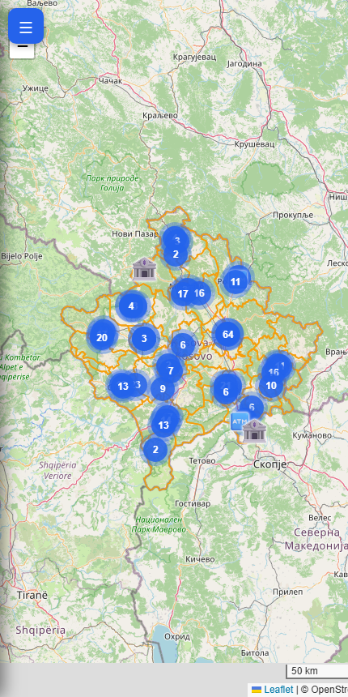

# UNIVERSITETI I PRISHTINËS "HASAN PRISHTINA"
### FAKULTETI I INXHINIERISË SË NDËRTIMIT — Departamenti i Gjeodezisë

<br>

## DETYRË

**LËNDA:** Web GIS
**TEMA:** Krijimi i një WebGIS-i për *Bankat, ATM-të dhe pikat e transferit të parave në Kosovë*

<br><br>

| Mentori: | Punoi: |
|---|---|
| Prof. Asoc. Dr. Bashkim IDRIZI | *[Emri Mbiemri]* |

**Prishtinë, 2026**

---

## Përmbajtja

- Kërkesat e detyrës
- Hyrja
1. Përzgjedhja e temës dhe territorit; qëllimet, grupet e interesit dhe shfrytëzimi
2. Përcaktimi i përmbajtjes gjeografike
3. Përcaktimi i elementeve matematike
4. Dizajnimi i arkitekturës së aplikacionit
5. Krijimi i çelësit hartografik
6. Elementet redaktuese/ndihmëse dhe funksionet e aplikacionit
7. Ndërtimi i aplikacionit (web + mobil)
8. Publikimi / shpërndarja e aplikacionit
9. Krijimi i web-serviseve (WMS/WFS)
10. Përdorimi i web-serviseve të krijuara
- Përfundime dhe referenca

---

## Kërkesat e detyrës

Detyra punohet individualisht dhe është kusht për hyrje në provim. Studenti përzgjedh vetë territorin, shkallën, vëllimin dhe temën.

1. Përzgjedhja e temës dhe territorit; qëllimet, grupet e interesit, shfrytëzimi
2. Përcaktimi i përmbajtjes gjeografike (të dhëna nga web-servise/shtresa të hapura + shtresa personale)
3. Përcaktimi i elementeve matematike
4. Dizajnimi i arkitekturës së aplikacionit
5. Krijimi i çelësit hartografik dhe standardeve për paraqitje multishkallore
6. Elementet redaktuese/ndihmëse dhe funksionet: **a)** Crowdsourcing/VGI (editim i kufizuar), **b)** shkarkim të dhënash sipas kriterit, **c)** kërkim/selektim/analizë hapësinore, **d)** simbolizim sipas kritereve
7. Ndërtimi i aplikacionit: **a)** versioni web, **b)** versioni mobil
8. Publikimi / shpërndarja e aplikacionit
9. Krijimi i web-serviseve (WMS, WFS)
10. Përdorimi i web-serviseve të krijuara

---

## Hyrja

- Zhvillimi i teknologjisë së informacionit ka transformuar Sistemet e Informacionit Gjeografik (GIS), duke i bërë hartat interaktive dhe të qasshme përmes internetit. **WebGIS-i** ndërthur hartat digjitale me teknologjitë web për vizualizim, analizë dhe qasje të lehtë në të dhënat hapësinore.
- Shërbimet financiare — **bankat, bankomatet (ATM) dhe pikat e transferit të parave** — janë infrastrukturë e përditshme për qytetarët. Vendndodhja e tyre është informacion tipik hapësinor që përfiton nga paraqitja në hartë interaktive.
- Ky projekt ndërton një aplikacion WebGIS që paraqet **bankat, ATM-të dhe transferet në të gjithë Kosovën**, me filtrim, analizë hapësinore, kontribut nga përdoruesit (VGI), raportim problemesh dhe shkarkim të dhënash.
- Teknologjitë: **QGIS** (organizim/vizualizim), përpunim i të dhënave me skripte, **GeoJSON**, **Leaflet** (harta web), **Supabase/PostGIS** (databaza), **GeoServer** (WMS/WFS) dhe **GitHub Pages** (publikim).
- Aplikacioni është publik dhe live: **https://leunisf.github.io/web-gis-bank/**


*Figura 1. Pamja e përgjithshme e aplikacionit WebGIS (versioni web).*

---

## 1. Përzgjedhja e temës dhe territorit; qëllimet, grupet e interesit dhe shfrytëzimi

**Tema:** WebGIS për bankat, ATM-të dhe transferet në Kosovë.
**Territori:** e gjithë **Republika e Kosovës**, e ndarë në **38 komuna**.

**Pse kjo temë:**
- Të dhëna reale, me interes të gjerë publik (qytetarë, biznese, turistë).
- Mundëson të gjitha kërkesat e detyrës: shumë pika (gjeometri pikësore), poligone (komunat), analiza hapësinore dhe shërbime web.

**Qëllimet:**
- Vizualizimi i bankave/ATM-ve/transfereve në hartë interaktive.
- Kërkimi dhe filtrimi sipas komunës, llojit dhe markës.
- Analiza hapësinore (buffer, matje distance, dendësi për komunë).
- Kontribut nga përdoruesit dhe raportim i problemeve (p.sh. ATM jashtë shërbimit).

**Grupet e interesit:**
- **Qytetarët** — gjejnë bankën/ATM-në më të afërt dhe raportojnë probleme.
- **Bankat / institucionet financiare** — pasqyrë e shpërndarjes dhe njoftim për probleme.
- **Studiues/analistë** — analiza e mbulimit financiar sipas komunave.
- **Studentët e GIS-it** — shembull praktik i një WebGIS-i të plotë.


*Figura 2. Territori i projektit — 38 komunat e Kosovës (paraqitje me ngjyrosje sipas numrit të bankave).*

---

## 2. Përcaktimi i përmbajtjes gjeografike

Të dhënat vijnë nga **web-servise/shtresa të hapura** dhe nga **shtresa personale** të përpunuara gjatë projektit.

**a) Të dhëna nga shtresa të hapura / web-servise:**
- **OpenStreetMap (OSM)** — harta bazë (tiles) dhe pikat e shërbimeve financiare.
- **HOTOSM (Humanitarian OSM Team)** — eksport i posaçëm *financial services points* për Kosovën (704 pika).
- **Basemaps:** OpenStreetMap, Carto Light dhe Esri Satellite (XYZ tiles).

**b) Shtresa personale (të përpunuara):**
- **Kufijtë e 38 komunave** (poligone) — riprojektuar dhe të pastruara.
- **Shtresa e kombinuar dhe e klasifikuar** e pikave, e ndarë në tri lloje:

| Lloji | Numri | Përshkrim |
|---|---|---|
| 🏦 **Bankë** | 182 | Banka komerciale të licencuara (Raiffeisen, ProCredit, TEB, NLB, BKT, BPB, Banka Ekonomike, etj.) |
| 🏧 **ATM** | 166 | Bankomatet |
| 💱 **Transfer** | 232 | Western Union, Ria/Capital, MoneyGram, këmbimore, etj. |
| | **580 gjithsej** | |

**Përpunimi i të dhënave (përmbledhje):**
- Kombinim i të dhënave të vjetra OSM me eksportin e ri HOTOSM, me **heqje dublikatash sipas `osm_id`**.
- **Pastrim**: largim i emrave të gabuar/jo-relevantë (p.sh. emra personash, “status bank” por jo banka reale).
- **Klasifikim** automatik në bankë / ATM / transfer sipas etiketave (`amenity`) dhe markës.
- **Caktim i komunës** për çdo pikë me algoritmin *pikë-në-poligon* (ray casting).


*Figura 3. Përmbajtja gjeografike: tri llojet e pikave me ikona të veçanta mbi territorin e Kosovës.*

---

## 3. Përcaktimi i elementeve matematike

- **Sistemet koordinative (CRS):**
  - Pikat (banka/ATM/transfer): **EPSG:4326 (WGS84)** — gjeografik.
  - Kufijtë e komunave (burimi): **KOSOVAREF01 / Balkans Zone 7 (EPSG:6870/9141)** — Transverse Mercator mbi elipsoidin GRS80.
  - Paraqitja në web: **EPSG:3857 (Web Mercator)** — standardi i tiles-ve.
- **Riprojektimi (komunat 6870 → 4326):** u realizua me formulat e **inverse Transverse Mercator**, me parametrat:
  - Meridiani qendror (CM) = **21°**, faktori i shkallës **k₀ = 0.9999**, *False Easting* = **7 500 000 m**, *False Northing* = 0, elipsoid **GRS80**.
  - Hapat: gjerësia ndihmëse (*footprint latitude* φ₁ nëpërmjet serisë së harkut meridional), rrezet e kurbaturës **N₁** dhe **R₁**, dhe seritë korrigjuese deri në rendin e 6-të/8-të.
- **Funksione të tjera matematike në aplikacion:**
  - **Matje distance** mbi sferë me formulën **haversine** (rezultat në m/km).
  - **Pikë-në-poligon** (ray casting) për caktimin e komunës.
  - **Shkalla dhe nivelet e zmadhimit** (zoom 7–19), shkallë grafike dinamike poshtë-djathtas.


*Figura 4. Elementet matematike: shkalla grafike (poshtë-djathtas) dhe vegla e matjes së distancës.*

---

## 4. Dizajnimi i arkitekturës së aplikacionit

Arkitektura ndjek modelin klasik me tri nivele (*three-tier*):

```
   NIVELI I TË DHËNAVE          NIVELI LOGJIK (server)            NIVELI PREZANTUES
 ┌───────────────────┐      ┌──────────────────────────┐      ┌────────────────────┐
 │  GeoJSON (statik)  │      │  GeoServer  → WMS / WFS   │      │  Shfletuesi (web)   │
 │  Shapefile bazë    │ ───► │  Supabase   → PostGIS/API │ ───► │  Leaflet + HTML/CSS │
 │  Komunat, pikat    │      │  GitHub Pages → hosting   │      │  + JavaScript       │
 └───────────────────┘      └──────────────────────────┘      └────────────────────┘
        Data tier                   Logical / middle tier            Presentation tier
                         HTTP request  ⇄  HTTP response (URL/HTTP/HTML/JSON)
```

- **Niveli i të dhënave (gjeodatabaza):** të dhënat hapësinore në GeoJSON + shapefile bazë, plus databaza online në **Supabase (PostGIS)** për kontributet dhe raportimet.
- **Niveli logjik:** **GeoServer** publikon shtresat si web-servise (WMS/WFS); **Supabase** ofron REST-API mbi PostGIS; **GitHub Pages** strehon faqen.
- **Niveli prezantues:** harta interaktive **Leaflet** në HTML/CSS/JavaScript, e qasshme nga kompjuteri dhe telefoni.

> Teknologjitë: QGIS, GeoServer, Supabase/PostGIS, HTML, CSS, JavaScript, Leaflet, Git/GitHub.

### 4.1. Përpunimi i të dhënave
- Të dhënat burimore (OSM/HOTOSM + kufijtë e komunave) u organizuan dhe u kontrolluan në **QGIS**.
- Konvertimi/pastrimi (shapefile → GeoJSON, riprojektim, kombinim, klasifikim, caktim komune) u automatizua me **skripte** të dedikuara, duke prodhuar skedarët përfundimtarë: `bankat.geojson`, `atm.geojson`, `transferet.geojson`, `komunat.geojson`.

### 4.2. Publikimi i të dhënave në GeoServer
- Krijohet një **workspace** (`webgis`), pastaj një **store** ku ngarkohet shapefile-i bazë.
- Shtresat **publikohen** si WMS/WFS me CRS dhe shtrirje të përcaktuar; simbolizimi mund të jepet me **SLD**.

### 4.3. Paraqitja e hartës (faqja HTML)
- Faqja kryesore **`index.html`** ndërton ndërfaqen; logjika në **`app.js`**; stili në **`style.css`**.
- Të dhënat ngarkohen si GeoJSON dhe (opsionalisht) si shtresa **WMS** nga GeoServer.

### 4.4. Qasja e përdoruesve
- Aplikacioni publikohet online me **GitHub Pages** dhe është i qasshëm nga çdo pajisje me shfletues.

*[📷 Opsionale — Figura: diagrami i arkitekturës dhe pamje nga GeoServer (workspace/store/style).]*

---

## 5. Krijimi i çelësit hartografik

- Çelësi hartografik (legjenda) shpjegon çdo simbol, që harta të jetë e lexueshme për të gjitha grupet e interesit.
- Tri llojet kanë **ikona dhe ngjyra të dallueshme**, me **ikonën e bankës pak më të madhe** (pesha vizuale):

| Simboli | Kuptimi | Ngjyra |
|---|---|---|
| 🏦 | Bankë | blu |
| 🏧 | ATM | jeshile |
| 💱 | Transfer (WU, Ria, këmbim…) | vjollcë |
| ▭ | Kufi komune | portokalli |

- **Paraqitje multishkallore (clustering):** në zoom të vogël pikat grupohen në *clustera* me numër; në zoom të madh shfaqen individualisht me ikonën përkatëse.
- Legjenda përditësohet automatikisht edhe kur aktivizohet simbolizimi tematik (choropleth).


*Figura 5. Çelësi hartografik dhe paraqitja multishkallore (clustering) e të dhënave.*

---

## 6. Elementet redaktuese/ndihmëse dhe funksionet e aplikacionit

### 6.1. Crowdsourcing / VGI (editim i kufizuar)
- Përdoruesi mund të **shtojë** një bankë/ATM/transfer të re duke klikuar në hartë dhe duke plotësuar formën (lloji, emri/marka).
- Kontributi ruhet si **“pending”** (në pritje) — pra **editim i kufizuar**: shfaqet, por **moderohet** para se të bëhet zyrtar.
- Përdoruesi mund edhe ta **fshijë** pikën që ka shtuar vetë (buton “🗑️ Fshi këtë pikë”).
- **Raportim problemi:** për çdo pikë ekziston butoni **“⚠️ Raporto problem”**, ku zgjidhet lloji i problemit (*ATM nuk punon, jashtë shërbimit, vendndodhje e gabuar, e mbyllur, tjetër*) dhe shkruhet një **përshkrim/koment**.
- Të dhënat e kontributeve/raportimeve ruhen në **databazën Supabase (PostGIS)**:

| Tabela | Përmbajtja | Fushat kryesore |
|---|---|---|
| `contributions` | Pikat e shtuara nga VGI | fclass, name, banka, lon, lat, geom, status |
| `reports` | Raportimet e problemeve | fclass, banka, problem, koment, lon, lat, status |

- Gjeometria (`geom`) gjenerohet automatikisht nga koordinatat me një **trigger PostGIS**; qasja kontrollohet me **RLS** (Row Level Security): shtim publik si *pending*, moderim vetëm nga prodhuesi.

*[📷 Figura 6 — shto screenshot të formularit “Raporto problem” / “Shto pikë” të hapur në aplikacion.]*

### 6.2. Shkarkim i të dhënave sipas kriterit
- Përdoruesi shkarkon **rezultatin aktual** (pas filtrit) në dy formate:
  - **GeoJSON** — format tekstual i bazuar në JSON për të dhëna hapësinore (pika/linja/poligone + atribute).
  - **CSV** — tabelë me lloji, emri, marka, komuna, koordinata.

*[📷 Figura 7 — shto screenshot të butonave të shkarkimit dhe skedarit të shkarkuar.]*

### 6.3. Kërkim, selektim dhe analizë hapësinore
- **Kërkim** me tekst (emër banke/marke) dhe **filtra** sipas: **Komunës**, **Llojit** (bankë/ATM/transfer) dhe **Markës**.
- **Analizë buffer:** kliko një pikë në hartë dhe një rreze (m) → aplikacioni numëron sa banka/ATM/transfere bien brenda rrezes.
- **Matje distance:** kliko pika radhazi → vizatohet vija dhe llogaritet distanca kumulative (haversine).
- **Ndalim i selektimit të komunave:** për lehtësi gjatë analizave, klikimi mbi poligonet e komunave mund të çaktivizohet (që klikimi të kalojë në hartë).

### 6.4. Simbolizim sipas kritereve të përdoruesit
- **Choropleth:** me një klik, komunat **ngjyrosen sipas numrit të bankave** (sa më e errët, aq më shumë), pikat fshihen dhe shfaqet **emri i komunës në qendër** të secilit poligon.
- Funksioni i kërkesës 6.c (analiza/numri për komunë) lidhet drejtpërdrejt me simbolizimin tematik të kërkesës 6.d.


*Figura 8. Simbolizim tematik (choropleth) sipas numrit të bankave për komunë, me emrat e komunave.*

---

## 7. Ndërtimi i aplikacionit

### 7.1. Versioni për web
- Ndërfaqe me **panel anësor** (kërkim/filtra, analiza, shkarkim, raportim, VGI, shtresat, legjenda) dhe **hartë** kryesore.
- **Header** me titullin/identifikimin; **footer/statusi** me sistemin koordinativ, shkallën dhe autorin.
- Vegla standarde: kontroll i shtresave, zgjedhje basemap, zoom in/out, shkallë grafike.
- **Dygjuhësi SQ/EN:** butoni në header ndërron gjuhën (shqip/anglisht) dhe ruan zgjedhjen.


*Figura 9. Versioni web (shqip).*


*Figura 10. I njëjti aplikacion në anglisht (ndërrim gjuhe me një klik).*

### 7.2. Versioni për mobil
- Dizajn **responsive**: paneli kthehet në meny të palosshme (butoni ☰), harta zë tërë ekranin.
- Funksionet kryesore ruhen; mund të vendoset edhe një **shortcut** në ekranin kryesor të telefonit.


*Figura 11. Versioni për mobil (ndërfaqe e përshtatur, paneli i palosur).*

---

## 8. Publikimi / shpërndarja e aplikacionit

- Kodi ruhet në **GitHub** (kontroll versioni me Git): krijimi i një *repository* publik dhe ngarkimi i skedarëve (`index.html`, `app.js`, `style.css`, `data/`, etj.).
- Aktivizimi i **GitHub Pages** (dega `main`, root) gjeneron linkun publik.
- **Versionim:** u shënua një version stabël **`v1.0`** (tag + release); për të shmangur cache-in e vjetër përdoret *cache-busting* (`?v=N`).
- **Live:** **https://leunisf.github.io/web-gis-bank/**

*[📷 Figura 12 — shto screenshot të repository-t në GitHub dhe seksionit Settings → Pages.]*

---

## 9. Krijimi i web-serviseve (WMS/WFS)

- Për shpërndarjen e të dhënave te palë të treta përdoret **GeoServer** (i përgatitur me `docker-compose`).
- Pas publikimit të shtresave, GeoServer ofron automatikisht:
  - **WMS (Web Map Service)** — paraqitje vizuale e hartës si imazh; shtresat shfaqen pa shkarkuar të dhënat origjinale.
  - **WFS (Web Feature Service)** — qasje direkte në të dhënat vektoriale dhe atributet (lexim/analizë nga aplikacione të tjera).
- Aplikacioni është **i integruar me GeoServer**: te paneli i shtresave ka opsionin *“WMS nga GeoServer”* dhe një buton *“Test WFS”*; mjafton të vendoset URL-ja e GeoServer-it në konfigurim (`GEOSERVER.url`) për t'i aktivizuar live.

*[📷 Figura 13 — shto screenshot të publikimit të shtresave në GeoServer (workspace/store/layers, WMS/WFS).]*

---

## 10. Përdorimi i web-serviseve të krijuara

- Web-serviset mund të **konsumohen** në dy mënyra:
  - **Brenda aplikacionit web** — shtresa WMS shtohet drejtpërdrejt në Leaflet; “Test WFS” merr objektet (GetFeature) nga GeoServer-i.
  - **Në QGIS / softuer të tjerë GIS** — duke shtuar lidhje *WMS/WMTS* ose *WFS* me URL-në e GeoServer-it, shtresat shfaqen dhe përdoren në kohë reale për analiza.

*[📷 Figura 14 — shto screenshot të lidhjes WMS/WFS në QGIS (Data Source Manager).]*

---

## Përfundime dhe punë e ardhshme

- U realizua një **WebGIS i plotë** për bankat, ATM-të dhe transferet në Kosovë, që plotëson të 10 kërkesat e detyrës: të dhëna nga shtresa të hapura + personale, elemente matematike (CRS/riprojektim), arkitekturë me databazë e server, çelës hartografik multishkallor, VGI me moderim, shkarkim, kërkim/analizë hapësinore, simbolizim tematik, version web + mobil, publikim online dhe web-servise WMS/WFS.
- **Punë e ardhshme:** vendosja live e GeoServer-it (WMS/WFS realë), pasurim i atributeve të bankave dhe pasqyrë administrative e raportimeve/kontributeve.

### Plotësimi i kërkesave (përmbledhje)

| # | Kërkesa | Statusi |
|---|---|---|
| 1 | Temë, territor, qëllime, grupe interesi | ✅ |
| 2 | Përmbajtja gjeografike (open + personale) | ✅ |
| 3 | Elementet matematike (CRS/riprojektim) | ✅ |
| 4 | Arkitektura e aplikacionit | ✅ |
| 5 | Çelësi hartografik + multishkallë | ✅ |
| 6a | Crowdsourcing/VGI + raportim | ✅ |
| 6b | Shkarkim (GeoJSON/CSV) | ✅ |
| 6c | Kërkim/selektim/analizë (buffer, matje) | ✅ |
| 6d | Simbolizim sipas kritereve (choropleth) | ✅ |
| 7 | Versioni web + mobil | ✅ |
| 8 | Publikimi (GitHub Pages) | ✅ |
| 9 | Web-servise WMS/WFS | ✅ (i përgatitur me GeoServer) |
| 10 | Përdorimi i web-serviseve | ✅ |

### Referenca dhe linqe

- **Aplikacioni live:** https://leunisf.github.io/web-gis-bank/
- **Kodi (GitHub):** https://github.com/leunisf/web-gis-bank
- **Të dhënat:** OpenStreetMap — https://www.openstreetmap.org ; HOTOSM Export — https://export.hotosm.org
- **Teknologjitë:** Leaflet (leafletjs.com), GeoServer (geoserver.org), Supabase/PostGIS (supabase.com, postgis.net), QGIS (qgis.org)
