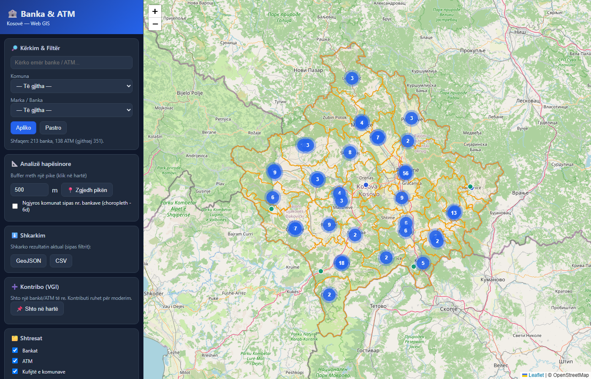

# DETYRË KURSI — WEB GIS
## Aplikacion Web GIS: Bankat dhe Bankomatët (ATM) në Kosovë

**Lënda:** Web GIS  
**Tema:** Shpërndarja hapësinore e bankave dhe ATM-ve në Kosovë  
**Territori:** Republika e Kosovës (38 komuna)  

---

## 1. Tema, territori, qëllimi, grupet e interesit dhe shfrytëzimi

**Tema:** Lokalizimi, kërkimi dhe analiza hapësinore e institucioneve bankare (degë bankash) dhe
bankomatëve (ATM) në Kosovë.

**Territori dhe shkalla:** I gjithë territori i Kosovës, në nivel komune (38 njësi), me paraqitje
multishkallore nga niveli shtetëror (zoom ~9) deri në nivel rruge (zoom ~16).

**Qëllimi:**
- T’u mundësojë qytetarëve dhe vizitorëve gjetjen e shpejtë të bankës/ATM-së më të afërt.
- Të paraqesë shpërndarjen dhe **densitetin** e shërbimeve bankare sipas komunave (mbulim/qasje).
- Të lejojë kontribut të komunitetit (VGI) për përditësimin e të dhënave.

**Grupet e interesit:**
| Grupi | Përfitimi |
|---|---|
| Qytetarë / vizitorë | Gjetje e shërbimit më të afërt, navigim |
| Banka / institucione financiare | Analizë mbulimi dhe konkurrence hapësinore |
| Banka Qendrore / rregullatorë | Mbikëqyrje e shpërndarjes së shërbimeve |
| Studiues / urbanistë | Analiza e qasjes në shërbime financiare |

**Shfrytëzimi:** ueb (desktop) dhe celular (responsive), si dhe përmes shërbimeve WMS/WFS nga palë të treta.

---

## 2. Përmbajtja gjeografike

### a) Të dhëna nga ueb-servise dhe shtresa të hapura
- **Basemap-e:** OpenStreetMap, CARTO Light, Esri World Imagery (satelit).
- Mundësi konsumimi i shërbimeve **WMS/WFS** (të krijuara në pikën 9).

### b) Të dhëna nga shtresa personale
| Shtresa | Tipi | Nr. objektesh | Burimi |
|---|---|---|---|
| Bankat | Pikë | **213** | OpenStreetMap (fclass = bank) |
| ATM | Pikë | **138** | OpenStreetMap (fclass = atm) |
| Komunat | Poligon | **38** | Kufijtë zyrtarë administrativë |

Përpunimi (Faza 0, `scripts/prepare-data.ps1`): konvertim SHP→GeoJSON, **pastrim emrash** (normalizim
i markave: “T E B / TEB Bank / TEB HQ” → TEB; “Raiffeisen / Raiffeisen Bank Kosovo” → Raiffeisen Bank, etj.),
caktim i **komunës** për çdo pikë me *point-in-polygon*, dhe llogaritje e numrit të bankave/ATM-ve për komunë.

---

## 3. Elementet matematike

- **Sistemi koordinativ i të dhënave origjinale:**
  - Bankat & ATM: **EPSG:4326** (WGS84, gjeografik).
  - Komunat: **KOSOVAREF01 / Balkans Zone 7** (Transverse Mercator, GRS80, EPSG:6870):
    Central Meridian 21°, Scale Factor 0.9999, False Easting 7 500 000 m, False Northing 0.
- **Riprojektimi:** komunat u shndërruan nga EPSG:6870 → **EPSG:4326** me formulat e
  *inverse Transverse Mercator* (zbatuar në `prepare-data.ps1`), pasi diferenca e datumit
  KOSOVAREF01↔WGS84 është nën-metrike dhe e papërfillshme për shkallën e hartës.
- **Sistemi i paraqitjes (web):** **EPSG:3857** (Web Mercator) — standardi i tile-ve të web-it.
- **Shkalla:** paraqitje multishkallore, zoom 7–19.

> Korrektësia e riprojektimit u verifikua vizualisht: kufijtë e komunave përputhen me basemap-in
> (shih `docs/img/aplikacioni.png`).

---

## 4. Arkitektura e aplikacionit

```
        GitHub Pages (klienti)                 CLOUD
   ┌──────────────────────────────┐   ┌──────────────────────────┐
   │  Leaflet (HTML/CSS/JS)        │──▶│  Supabase (PostGIS)       │
   │  responsive (web + mobil)     │   │  kontributet VGI + API    │
   │  data/*.geojson               │   └──────────────────────────┘
   │                               │   ┌──────────────────────────┐
   │  konsumon WMS/WFS             │──▶│  GeoServer (Docker)       │
   └──────────────────────────────┘   │  WMS + WFS                │
                                       └──────────────────────────┘
```
- **Front-end:** Leaflet + Leaflet.markercluster (statik, pa build) → GitHub Pages.
- **Back-end të dhënash/VGI:** Supabase (PostgreSQL + PostGIS) ose localStorage (fallback demo).
- **Shërbime OGC:** GeoServer (WMS/WFS).

---

## 5. Çelësi hartografik dhe paraqitja multishkallore

**Çelësi hartografik (legjenda):**
| Simbol | Kuptimi |
|---|---|
| 🔵 Rreth blu | Bankë |
| 🟢 Rreth jeshil | ATM |
| 🟧 Vijë portokalli | Kufi komune |
| Gradient i kuq | Choropleth: nr. i bankave për komunë |

**Paraqitja multishkallore:**
- Në zoom të vogël, pikat **grupohen** në cluster-a me numër (densitet i përgjithshëm).
- Në zoom ≥ 14, cluster-at shpërbëhen dhe shfaqen objektet **individuale** me popup.
- Komunat shërbejnë si njësi agregimi për choropleth-in.

---

## 6. Elementet redaktuese/ndihmëse dhe funksionet e aplikacionit

### a) Crowdsourcing / VGI — editim i kufizuar
Forma **“Kontribo (VGI)”**: përdoruesi klikon në hartë, zgjedh llojin (bankë/ATM) dhe emrin, dhe e ruan.
Kontributi ruhet me status **`pending`** (editim i kufizuar) → moderohet nga prodhuesi përpara se të bëhet
zyrtar. Zbatim me Supabase + **Row Level Security** (`db/supabase-contributions.sql`): publiku mund të
*shtojë* vetëm si `pending`; vetëm përdoruesi i autentikuar (moderatori) *aprovon/fshin*.

### b) Shkarkim sipas kriterit
Butoni **Shkarkim** eksporton rezultatin aktual (sipas filtrit) në **GeoJSON** ose **CSV**.

### c) Kërkim, selektim dhe analizë hapësinore
- **Kërkim** me tekst (emër/markë) dhe **filtra** sipas komunës dhe markës.
- **Analizë buffer:** klik në hartë + rreze (m) → selekton e numëron bankat/ATM brenda rrezes
  (distancë *haversine*).
- **Point-in-polygon:** çdo objekt është i lidhur me komunën e vet (i llogaritur në Fazën 0).

### d) Simbolizim sipas kritereve të përdoruesit (bazuar në c)
**Choropleth** që ngjyros komunat sipas numrit të bankave (5 klasa), me legjendë dinamike.

---

## 7. Ndërtimi i aplikacionit

- **a) Versioni për ueb:** `index.html` + `style.css` + `app.js` (Leaflet).
- **b) Versioni për mobil:** i njëjti kod, **responsive** (media queries < 768px), me panel anësor
  që hapet/mbyllet me buton, i përshtatshëm për ekran me prekje.

---

## 8. Publikimi / shpërndarja

- Front-end publikohet falas në **GitHub Pages** (udhëzimet te `README.md`).
- Shërbimet WMS/WFS publikohen përmes **GeoServer** (lokal ose cloud — Render/Koyeb/Fly.io).

---

## 9. Krijimi i ueb-serviseve për palë të treta

Përmes GeoServer (`geoserver/docker-compose.yml`, udhëzimet te `geoserver/README.md`):
- **a) WMS** — `…/webgis/wms?service=WMS&request=GetCapabilities`
- **b) WFS** — `…/webgis/wfs?service=WFS&request=GetCapabilities` (GetFeature → GeoJSON)

Këto URL mund të përdoren nga palë të treta (p.sh. të hapen drejtpërdrejt në **QGIS**).

---

## 10. Përdorimi i ueb-serviseve të krijuara

Aplikacioni ynë i konsumon shërbimet e veta:
- Checkbox-i **“WMS nga GeoServer”** shton shtresën WMS në hartë.
- Butoni **“Test WFS”** merr objektet nga **WFS** (GetFeature/GeoJSON) dhe i vizaton.

Kjo dëshmon ciklin e plotë: prodhim (9) → konsumim (10) i shërbimeve OGC.

---

## Statistika kryesore (nga të dhënat)
- 213 banka, 138 ATM, 38 komuna.
- Komunat me më shumë banka: **Prishtinë (48)**, Prizren (18), Gjakovë (16), Pejë (13), Gjilan (12).

## Përmbledhje e mbulimit të kërkesave
| Pika | Statusi |
|---|---|
| 1 Temë/territor/qëllim/grupe | ✅ |
| 2 Përmbajtja gjeografike (a,b) | ✅ |
| 3 Elementet matematike (CRS/riprojektim) | ✅ |
| 4 Arkitektura | ✅ |
| 5 Çelësi + multishkallore | ✅ |
| 6a VGI editim i kufizuar | ✅ |
| 6b Shkarkim sipas kriterit | ✅ |
| 6c Kërkim/selektim/analizë | ✅ |
| 6d Simbolizim sipas kritereve | ✅ |
| 7 Web + mobil (responsive) | ✅ |
| 8 Publikimi | ✅ (push nga studenti) |
| 9 WMS/WFS | ✅ (deploy nga studenti) |
| 10 Përdorim i WMS/WFS | ✅ |


